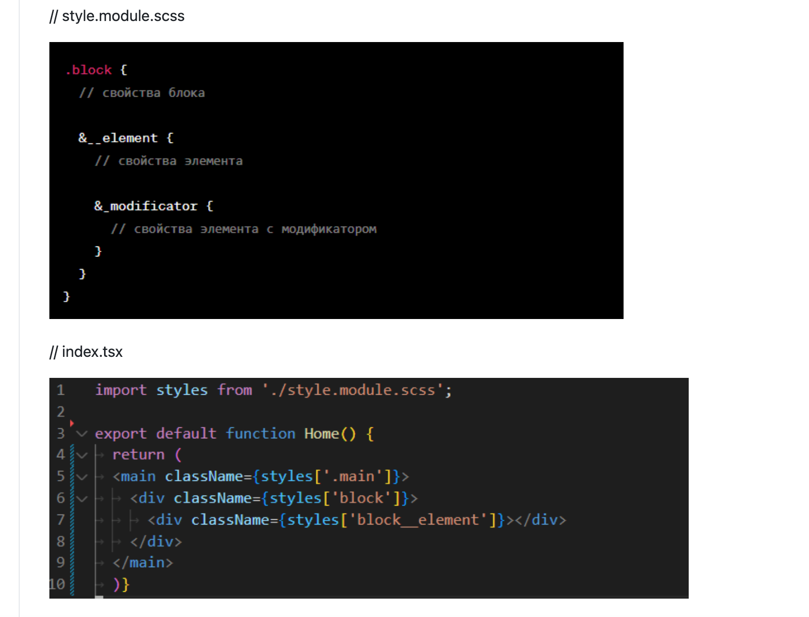

***Запуск локально:***
1) скопировать репозиторий
2) установить зависимости npm install
3) запустить проект npm run dev
 
 ***Правила оформления,  code-style :***

**App**

В папке app хранятся глобальные стили (пока пусто, наполним по необходимости) и страницы (например, 404 и Политика конфиденциальности)

**Components** 

В папке components хранятся компоненты. 
Каждый компонент расположен в отдельной папке. 
Папки с компонентами называются с заглавной буквы в CamelCase. 
Файл компонента называется index.jsx, файл со стилями - styles.module.scss 
Компонент называется с заглавной буквы в CamelCase. Импорт стилей называется styles. 
Импорт библиотеки classnames называется classNames. 
Компонент экспортируется по умолчанию.

**Images**

Изображения хранятся в папке public/images. Формат  - svg, форматы jpg/png следует переделать в формат webp ( нагуглить любой онлайн конвертор) для лучшей оптимизации приложения.
Группы изображений одного компонента хранятся в отдельной папке с названием компонента со строчной буквы в сamelCase. 
Изображения называются со строчной буквы в kebab-case.

**Constants**

В папке constants хранятся все константы проекта (пока не знаю, что там может быть, может, какие-то данные по которым будем делать map). 
Для констант из компонента внутри папки constants создается отдельная папка с названием компонента(например constants/Header). 
Внутри этой папки создается файл index.js в котором находятся сами константы.
Константы называем в camelCase.

**Далее приведены общие рекомендации по оформлению кода:**

1. ; - каждое объявление заканчивается точкой с запятой
2. ↹ интервалы - каждый новый уровень вложенности отделяется табом
3. { шаблонные строки } - используются вместо сложного объединения строк
4. ‘ ’ - используются одинарные кавычки, вместо двойных
5. ‘++’ ‘- -’ - унарные операторы присоединяются к операндам без пробела (i++)
6. , ; - перед запятой и точкой с запятой не ставятся пробелы
7. : - перед двоеточием после имени свойства в определении объекта не ставятся пробелы
8. ? : - знаки в тернарном условном операторе отделяются пробелами с двух сторон
9. {} () [] - в пустых конструкциях не ставятся заполняющие пробелы
10. === - используется строгая проверка на равенство (кроме проверки на равенство null)

**Стили** 

Стили пишем с использованием препроцессора SCSS.
Импорт стилей в компонентах называется styles.
Глобальные CSS переменные хранятся в файле app/globals.scss (чуть позже заполним). 
Файл дополняется по мере проработки макета и создания новых компонентов. 
Для именования класов тэгов разметки используем методологию БЭМ , block__element_modificator

Образец:

**Ветки и GitHub**

Наименование веток

Название ветки должно называться с категории:  
feature - для создания и редактирования фич  
bugfix - для исправления багов 
После категории идет ‘/’ и краткое описание изменения в kebab-case. 
Например: feature/main-section, bugfix/change-file-names.

Стадии такие: 
1. Взяла задачу, подвинула на доске в колонку "Выполняется"
2. Притянула ветку develop, ответивилась от нее, работаешь
3. После выполнения коммитишь изменения, делаешь пулл реквест в develop(!!!)
В reviewers можно тегнуть кого-то.
В assignees отмечаешь себя. Двигаешь задачу в "На ревью"
4. После аппрува хотя бы от одного из участников делаешь merge в develop + и если нет конфликтов.
5. Закрываешь задачу, удаляешь ветку, перемещаешь задачу в "Готово"
6. После закрытия пулла , пишем в Telegramm
Это надо делать, так как ветка develop обновилась и все должны локально притянуть изменения, чтобы не было конфликтов.
 
 В целом, перед каждым PR притягивайте develop и решайте конфликты ЛОКАЛЬНО, чтобы не было этой проблемы на этапе мерджа.